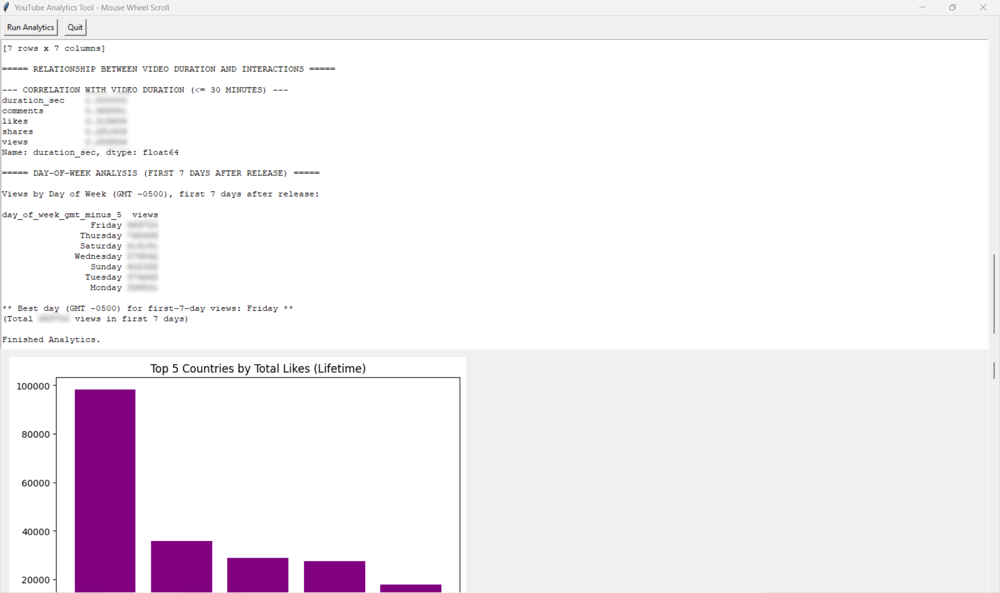

# YouTube Analytics Desktop Tool


A desktop GUI application for analyzing YouTube channel analytics with embedded visualizations. Built with Tkinter and Google YouTube API.



## ✨ Features

- **Dual-Pane Interface**
  - Top panel: Real-time logging with scrollable text area
  - Bottom panel: Interactive canvas for Matplotlib/Seaborn visualizations
  - Native Windows mouse wheel scrolling support

- **Comprehensive Analytics**
  - Channel statistics (subscribers, total views)
  - Country-level engagement analysis
  - Video performance metrics
  - Correlation matrices between metrics
  - Day-of-week viewing patterns
  - Video duration impact analysis

- **Data Visualization**
  - Interactive bar charts
  - Correlation heatmaps
  - Scatter plots with regression lines
  - Auto-refreshing plot gallery

## ⚙️ Installation

### Prerequisites
- Python 3.8+ (for source code execution)
- Google Cloud Platform project with YouTube API enabled

### 1. Obtain Client Secret JSON
**Step 1: Create Google Cloud Project**  
1. Visit [Google Cloud Console](https://console.cloud.google.com/)
2. Create a new project or select an existing one

**Step 2: Enable Required APIs**  
1. Navigate to **APIs & Services** > **Library**
2. Enable both:
   - **YouTube Data API v3**
   - **YouTube Analytics API**

**Step 3: Generate OAuth Credentials**  
1. Go to **APIs & Services** > **Credentials**
2. Click **Create Credentials** > **OAuth client ID**
3. Select application type: **Desktop app**
4. Download JSON credentials file (named `client_secret_XXXXX.json`)

### 2. File Placement
- **For EXE Users**:
  - Place `client_secret_XXXXX.json` in the same directory as `youtube_analytics_desktop.exe`
  - Executable location: `dis/youtube_analytics_desktop.exe`

- **For Source Code Users**:
  - Place `client_secret_XXXXX.json` in the same directory as `youtube_analytics_desktop.py`

### 3. Install Dependencies (Source Code Users)
```bash
pip install google-auth-oauthlib google-api-python-client \
    pycountry matplotlib seaborn isodate Pillow